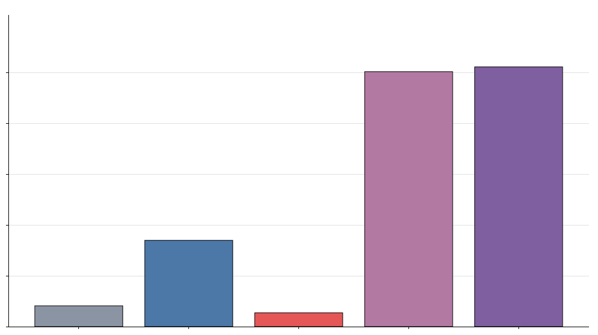
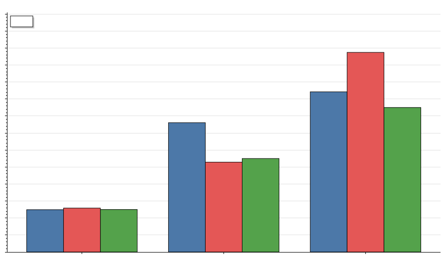
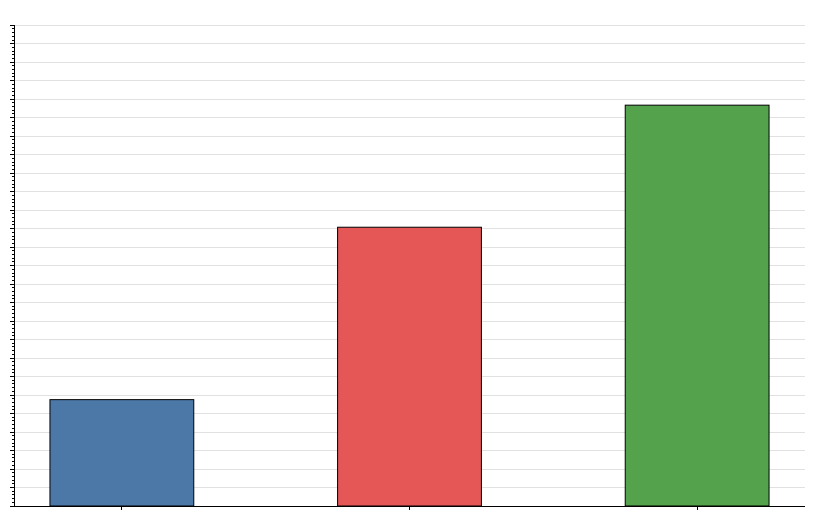
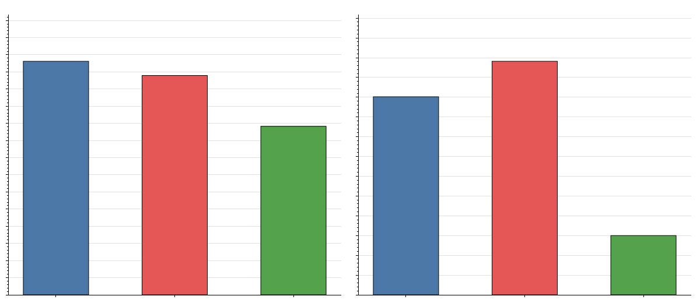
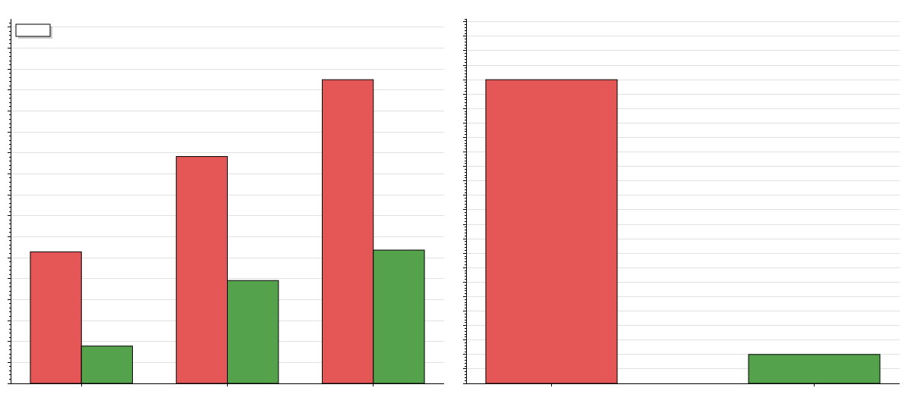
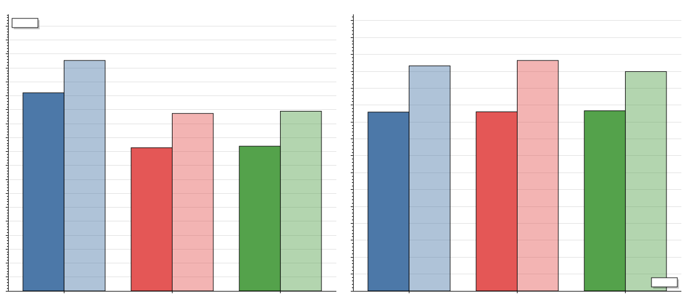

# Bid-Risk-Bench

An auction where every bid is scored for fraud risk by a machine-learning model, and a local LLM
answers plain-English questions about the data. It exists to measure **the same work over three
transports: gRPC, GraphQL, and a raw WebSocket**.

[The report](#the-report) is the deliverable.

## Quick start

```bash
cp .env.example .env
docker compose up --build
```

- GraphQL playground — <http://localhost:8080/graphql>
- The two transports racing — <http://localhost:8080/compare.html>

The first start pulls the Ollama model (105 s); later starts reuse the volume and are healthy in
19 s. Design and call paths: **[docs/DESIGN.md](docs/DESIGN.md)**.

## Commands

`make help` lists them all. Everything runs in containers.

| Command | What it does |
|---|---|
| `make proto` | Regenerate gRPC code for Python and C# from the one `.proto` |
| `make golden` | Regenerate the golden files the contract test reads |
| `make train` | Generate bids, train the model, write `models/` and the metrics below |
| `make up` / `make down` | Start / stop the stack |
| `make seed` / `make seed-data` | Load the fixed dataset / rebuild it first |
| `make test` / `make lint` | Unit + contract tests / every gate CI runs |
| `make integration` / `make smoke` | Bids end to end / one call on every transport |
| `make bench` | The full matrix, 3 runs → `bench/results/`, charts, the tables below |
| `make clean` | Remove generated code, the model and benchmark output |

After `make clean`, run `make proto` before anything else — the generated code is not committed.

## Using it

| What | Where |
|---|---|
| GraphQL playground | <http://localhost:8080/graphql> |
| Transport comparison page | <http://localhost:8080/compare.html> |
| Raw WebSocket — LLM tokens | `ws://localhost:8080/ws` |
| Raw WebSocket — scoring | `ws://localhost:8080/ws/score` |
| gRPC call counter (the N+1) | <http://localhost:8080/debug/grpc-calls> |
| auction-service · ml-service | `localhost:5001` · `localhost:5002` (reflection on) |

```bash
curl -s http://localhost:8080/graphql -H 'content-type: application/json' \
  -d '{"query":"{ lots(first: 3) { id title currentPrice riskLevel } }"}'
```

```json
{"data":{"lots":[{"id":40,"title":"Ended: brass telescope #40","currentPrice":263.79,"riskLevel":"LOW"},
                 {"id":39,"title":"Signed football shirt #39","currentPrice":367.58,"riskLevel":"HIGH"}]}}
```

`riskLevel` comes from ml-service, so that one query touched both services. A rejected bid comes
back as a result, not an error — `placeBid` returns `accepted`, the score and the reasons either
way.

To see the N+1: reset `/debug/grpc-calls`, run `lots(first: 3)`, read the counter. It reports 4
calls (one list, one per lot). Set `GATEWAY_BATCHING=true`, restart the gateway, and the same
query reports 2.

## Architecture

Five containers: `gateway` (C#, GraphQL + raw WebSocket, the only public door), `auction-service`
(C#, lots/bids/rules, owns the database), `ml-service` (Python, the risk model and the LLM
prompts), `ollama` (`llama3.2:1b` on CPU), `postgres`.

Every answer the LLM gives is built from numbers fetched out of the database. After each stream
ml-service re-reads its own answer and logs any figure the facts did not contain.

## The risk model

Five features per bid: bid ÷ current price (log, capped), time since the previous bid, this
bidder's bids on the lot, account age, and the bidder's share of the lot's bids. Trained offline
by `make train`; the service only loads the file.

<!-- METRICS -->

Trained on **4000 bids**, evaluated on a held-out **1000** (19.4% suspicious). Model: LogisticRegression on standardised features, fitted on the true class balance.

At the threshold the service actually rejects on (**0.7**):

| Metric | Value |
|---|---|
| Accuracy | **0.927** |
| Precision | **0.948** |
| Recall | **0.660** |
| ROC AUC | 0.846 |

**The score is a probability, not just a ranking.** Mean predicted 0.191 against a true rate of 0.194, Brier 0.0622. That holds because the model is fitted on the real class balance — `class_weight='balanced'` would inflate every score. Imbalance is handled at the threshold instead.

**Precision matters most here.** A false positive rejects a real bidder's money in real time; a false negative stores a suspicious bid with its score, which can be reviewed later. So the threshold trades recall away to keep precision up.

How that trade-off moves with the threshold:

| Threshold | Precision | Recall | Bids flagged |
|---|---|---|---|
| 0.30 | 0.935 | 0.737 | 153 |
| 0.40 | 0.946 | 0.722 | 148 |
| 0.50 | 0.945 | 0.711 | 146 |
| 0.60 | 0.944 | 0.691 | 142 |
| 0.70 | 0.948 | 0.660 | 135 |
| 0.80 | 0.942 | 0.588 | 121 |
| 0.90 | 0.930 | 0.479 | 100 |

<sub>Generated by `make train` on 2026-08-16T12:19:58+00:00 · model version `bidrisk-20260816121958` · do not edit by hand.</sub>

<!-- /METRICS -->
## Where the requirements live

| Requirement | Where |
|---|---|
| `docker compose up` on a machine with only Docker | multi-stage builds, no SDK in any final image |
| One command updates both languages, contract test catches you | `make proto`; `scripts/proto-hash.sh` compared by tests in both languages |
| One command trains the model; metrics in the README | `make train` → the table above |
| LLM answers from real data and cites the numbers | `facts.py` builds the prompt from Postgres; `grounding.py` flags anything unsupported |
| Tokens stream over all three transports, side by side | <http://localhost:8080/compare.html> |
| Results file generated by the benchmark run | `make bench` → `bench/results/results.json` |
| README answers all six questions with numbers and graphs | [The report](#the-report) |
| §1 four services, gRPC only between them | `services/` |
| §2 one proto, both languages, enum + oneof + streaming | `proto/bidrisk/bidrisk.proto`, `tests/contract/golden/` |
| §3 pinned images, health checks, no sleeps, resource caps | `docker-compose.yml`, `.env.example` |
| §4 unit tests, one integration test, a smoke script, seed data | `make test` · `make integration` · `make smoke` · `make seed` |
| §5 ghz for gRPC, k6 for GraphQL and WebSocket, 3 runs, 10% rule | `scripts/bench.sh` |

Out of scope and not built: auth, payments, Kubernetes, cloud deploy, any UI beyond the comparison
page, deep learning, fine-tuning, RAG, vector databases, models above 1.5B parameters.

## The report

Every number comes from `make bench` and lives in
[`bench/results/results.json`](bench/results/results.json). The tables under
[The measurements](#the-measurements) are written by the benchmark run, not typed in.

<!-- REPORT -->

**The short version.** The model takes 0.26 ms. The LLM takes 10–15 seconds. The gap between the
fastest and slowest transport scoring a bid is a fraction of a millisecond. For this workload the
transport is not where the time goes.



### 1. Model inference vs the LLM, vs the transport

| | Time |
|---|---|
| Model inference, inside ml-service | **0.26 ms** |
| Score one bid end to end, gRPC | **4.98 ms** |
| gRPC → GraphQL difference | **0.19 ms** |
| LLM, first token | **10.3 s** |

**Does the transport choice matter for this workload? Not for latency.** The spread across all
three transports is under 0.2 ms, against an LLM that takes ten seconds. Even the 5 ms end-to-end
figure is mostly not the model: 0.26 ms of it is the prediction, the rest is network hops,
serialisation and queueing.

Where transports separate is the tail — see the p99 column below. It does not order the way I
expected: the raw WebSocket holds the tightest p99 and GraphQL the widest, with gRPC between them.
Across earlier runs that ordering moved around, so I would not read much into it.



### 2. Protobuf vs JSON

Protobuf is 1.8× to 3.9× smaller depending on the message. The ratio is widest on `BidContext`,
which is almost all numbers and timestamps, and narrowest on `RiskAssessment`, which is mostly
human-readable reason strings that cost the same either way.

**Does it still matter at 50 concurrent clients?** For bandwidth, no — the difference is around
1 MB/s, which is nothing. What it costs is CPU spent parsing, and that shows up in the p99 and
throughput columns rather than in a bandwidth graph.



### 3. 500 bids one at a time vs one batch call

Batching is roughly 100–350× faster depending on the transport. **The time is not going into the
model:** 500 predictions one at a time cost 500 × 0.26 ms = 130 ms of actual model work, and the
run takes over a second. The rest is round trips. The batch call does the same 500 predictions in
one vectorised pass and pays for one round trip.

The raw WebSocket gets the biggest ratio because it keeps one connection open for all 500
messages, so it never pays per-request setup.



### 4. What fixing the N+1 changed

`lots(first: 20)` needs the lots from auction-service and each lot's risk from ml-service. The
naive resolver asks per lot; the DataLoader collects the ids and asks once. Same image, one
environment variable apart.

**21 gRPC calls per query become 2**, and p50 drops by roughly 70%. `GET /debug/grpc-calls`
reports the counts, so the claim is checkable rather than asserted.

The fix had to go deeper than the gateway. Batching gateway→ml-service alone would leave
ml-service looping over lots calling auction-service — the same N+1 one hop down — so a
`GetBidHistoryBatch` RPC was added to carry the batching to the SQL query.



### 5. GraphQL subscription vs a plain WebSocket

Both stream the same tokens from the same single generation, so any difference is the transport.
Measured client-side and server-side, the transport's own share is tens of milliseconds against a
ten-second answer. On the comparison page the two panels fill at what looks like the same instant.

**Fan-out.** Fifty listeners sharing one `broadcastId` receive one generation, not fifty —
verified by the probe reporting a single distinct answer length across all fifty. First token
lands in the same range as a single listener.

One thing I could not fully explain: gRPC streaming consistently reports a slower first token
than the other two, even after each transport was given its own lot so no prompt cache is shared
and the probe was changed to reuse one connection. The server-side timing says the server really
did take that long to produce the token, so it is not the wire. I do not know what is left.



### 6. What would go where in production

**Public internet: GraphQL over HTTP, with a WebSocket for streaming.** Not because it is fast —
it is the slowest of the three here — but because speed is not the constraint at the edge.
Clients you do not control need a self-describing schema, one round trip for a screen of data, and
something that works through any proxy without special libraries. I would put a query-complexity
limit in front of it before worrying about the transport.

**Between services: gRPC.** The reasons GraphQL wins at the edge are irrelevant behind it. What
matters internally is what gRPC gives: one `.proto` both languages generate from so the services
cannot drift, the best p99 of the three, deadlines and cancellation as first-class concepts, and
streaming with no protocol layered on top.

**The raw WebSocket I would not ship.** It won the streaming benchmark because it does less — no
handshake protocol, no subscription lifecycle, no multiplexing, no error semantics beyond what I
invented. It was the right control for measuring what GraphQL's machinery costs, not a candidate.

**What I would actually optimise: none of it.** The LLM is four orders of magnitude larger than
anything the transport contributes. Time to first token scales with how much context goes into the
prompt, so the answer is a shorter prompt, a smaller model, or a GPU.

### What I do not trust

The scenarios marked ⚠️ below moved by more than 10% between runs *and* by more than 3 ms. Both
conditions are needed: a pure percentage rule flags a scenario whose p50 reads 3 ms one run and
4 ms the next, which is one tick of k6's clock rather than the system moving.

Getting the harness this far took four fixes, all of them mine rather than the system's: warm-ups
too short for .NET's tiered JIT, the gateway being restarted immediately before the two scenarios
most sensitive to that, no LLM warm-up at all so the first streaming run paid for the model load,
and all three transports asking about the same lot so whichever ran first paid the prompt
evaluation for the other two.

<!-- /REPORT -->

### The measurements

<!-- BENCH -->

<sub>Generated by `make bench` on 2026-08-16T12:32:13+00:00 · 3 runs per scenario · Ubuntu 24.04.4 LTS · do not edit by hand.</sub>

#### Scoring one bid — the same work over three transports

| Transport | p50 | p95 | p99 | throughput |
|---|---|---|---|---|
| gRPC | 4.98 ms | 15.22 ms | 18.85 ms | 1,667 req/s |
| GraphQL | 5.17 ms | 10.57 ms | 23.48 ms | 1,664 req/s |
| WebSocket | 5.00 ms | 11.00 ms | 17.00 ms | 1,561 req/s |

#### Message size, same data both ways

| Message | Protobuf | JSON | JSON is |
|---|---|---|---|
| `Lot` | 73 B | 176 B | 2.41× larger |
| `RiskAssessment` | 145 B | 260 B | 1.79× larger |
| `BidContext` | 64 B | 248 B | 3.88× larger |

#### 500 bids: one at a time versus one batch call

| Transport | 500 one at a time | 500 in one call | Ratio |
|---|---|---|---|
| gRPC | 1.4 s | 10.02 ms | 136× faster |
| GraphQL | 1.3 s | 11.82 ms | 108× faster |
| WebSocket | 1.0 s | 3.00 ms | 328× faster |

#### `lots(first: 20)` before and after the N+1 fix

| `GATEWAY_BATCHING` | gRPC calls per query | p50 | p95 | p99 | throughput |
|---|---|---|---|---|---|
| `off` (naive) | 21 | 125.57 ms | 216.53 ms | 289.86 ms | 73 req/s |
| `on` (DataLoader) ⚠️ | 2 | 35.61 ms | 98.15 ms | 127.24 ms | 215 req/s |
| direct gRPC `ListLots` | 1 | 1.82 ms | 9.74 ms | 68.27 ms | 2,341 req/s |

#### Streaming an LLM answer

| Scenario | Transport | Time to first token | Full answer |
|---|---|---|---|
| one listener | gRPC | 14.2 s | 16.5 s |
| one listener | GraphQL subscription | 10.3 s | 12.7 s |
| one listener | raw WebSocket | 10.4 s | 12.9 s |
| 50 listeners | gRPC | 10.6 s | 13.3 s |
| 50 listeners | GraphQL subscription | 10.6 s | 13.6 s |
| 50 listeners | raw WebSocket | 10.7 s | 13.0 s |

#### Resource use during the heaviest scoring run

| Container | Peak CPU | Peak memory | Cap |
|---|---|---|---|
| `gateway` | 14% | 110 MB | 1 CPU · 512 MB |
| `auction-service` | 22% | 97 MB | 1 CPU · 512 MB |
| `ml-service` | 72% | 99 MB | 1 CPU · 512 MB |
| `ollama` | 0% | 1,337 MB | 2 CPU · 4 GB |
| `postgres` | 0% | 59 MB | 1 CPU · 512 MB |

> ⚠️ These scenarios moved by more than 10 % between runs and are marked in the tables above: `lots_graphql_batched`. They are reported for completeness but should be read as indicative only.

<!-- /BENCH -->
### How the measurements were taken

- **`ghz` for gRPC, `k6` for GraphQL and WebSocket**, as required. One extra tool was needed: a
  small .NET probe ([`tools/BidRisk.Bench`](tools/BidRisk.Bench), `probe` verb) measures
  time-to-first-token for gRPC streaming, because `ghz` times whole calls and a server-streaming
  call takes as long as the model does.
- **Three runs per scenario.** The aggregator takes the median and flags anything that moved by
  more than 10% and more than 3 ms.
- **A discarded warm-up before every run** — .NET compiles in tiers, EF Core builds its model on
  first use, and Ollama loads the model on the first generation. Without it, run 1 measures the
  compiler.
- **Each streaming transport asks about a different lot**, rotated so each asks each lot once
  across the three runs. The prompt is built facts-first, and llama.cpp caches evaluated
  prefixes, so sharing a lot would let whichever ran first pay the prompt evaluation for the rest.
- **The load generators run on the compose network**, not through published host ports.
- **Identical work on every row.** All three transports score the same 500 bid contexts from a
  fixed seed, through a read-only `scoreBid` that passes straight to the same gRPC call.
  (`placeBid` could not serve this: it writes and raises the price, so the five hundredth call
  would be doing different work from the first.)
- **Bytes are counted at the container's own interface**, so framing and headers are included.
- **Resource caps are the ones the requirements specify**: 1 CPU and 512 MB for gateway, auction,
  ml and postgres; 2 CPU and 4 GB for ollama. The load generators are uncapped — the requirements
  do not cap them, and a generator that cannot saturate the service is not measuring its capacity.
