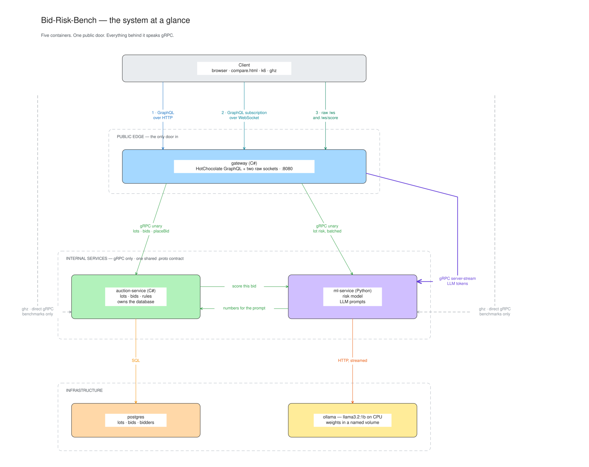
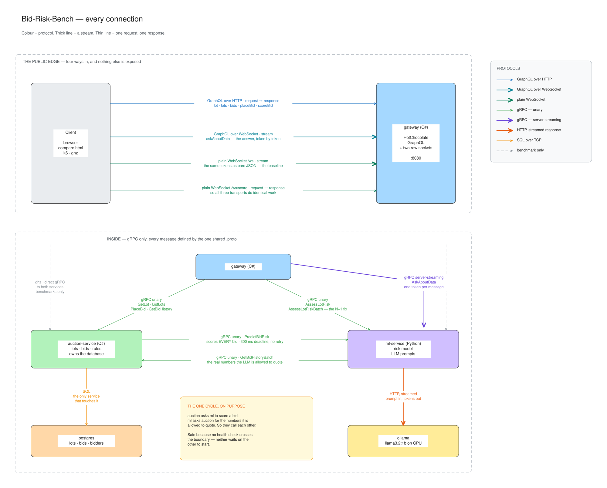
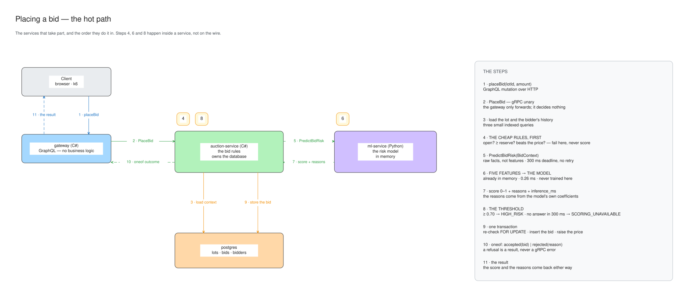
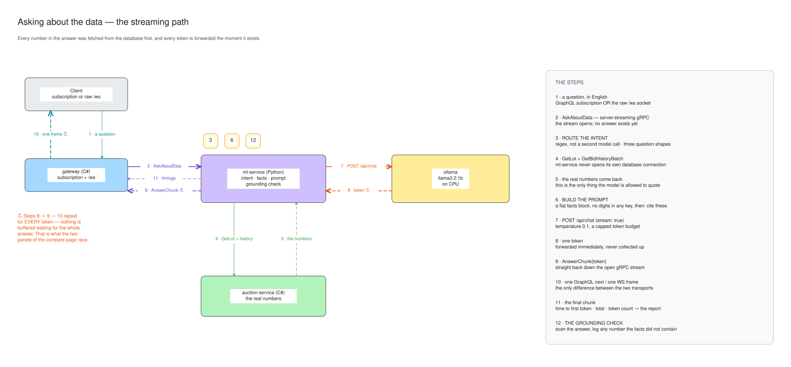

# Bid-Risk-Bench — Design Overview

The whole design in ten minutes. The measured results are the actual deliverable and live in the
[README report](../README.md#the-report); this document explains the system design and architecture.

## What this is, in three sentences

A small auction where every incoming bid is scored for fraud risk by a machine-learning model, and
a local language model (running in Ollama, so no data leaves the machine and there are no API keys)
answers plain-English questions about the auction data.

The same operations are exposed over **three transports — gRPC, GraphQL, and a raw WebSocket** — so
they can be measured against each other doing identical work.

The point of all of it is one question: **when the real work is a 0.26 ms model prediction and a
12-second LLM answer, does the choice of transport actually matter?** The report answers that with
numbers and graphs. The system exists to generate them.

## The system at a glance

Benchmarks also call `auction-service` and `ml-service` **directly over gRPC**, skipping the
gateway entirely, so the report can compare a transport against itself rather than against a
different number of network hops.

> ✏️ Every diagram in this document is a committed `.png` **and** an editable `.excalidraw` of the
> same name in [`docs/diagrams/`](diagrams/). The `.png` is what renders here on GitHub; open the
> `.excalidraw` at [excalidraw.com](https://excalidraw.com) (menu → Open) or with the VS Code
> Excalidraw extension to talk through the design live and draw on top of it.

## Every connection, named

The same picture with everything spelled out: all four public entrypoints, all eight internal
calls, colour-coded by protocol, each arrow carrying the exact RPC that travels on it.

It is laid out as two panels. The top panel is **the public edge**: the four and only four ways
into the system, which is where the three-transport comparison actually lives. The bottom panel is
**inside**: gRPC everywhere, every message defined by the one shared `.proto`, plus the dashed
lines showing where the benchmark harness bypasses the gateway.

Two things about the map are worth saying in words, because a picture states them without
explaining them.

**There is a cycle, and it is deliberate.** auction-service calls ml-service to score a bid;
ml-service calls auction-service to fetch the numbers the LLM is allowed to quote. Two services
that call each other is normally a design smell — the usual fear is a startup deadlock where each
waits for the other. That cannot happen here because **no health check crosses the boundary**.
Neither service reports itself unhealthy for being unable to reach the other, so Compose can bring
both up in any order.

**Only auction-service touches the database.** ml-service can read auction data, but only through
auction-service's gRPC API — never by opening its own connection to Postgres. That keeps the bid
rules, the money arithmetic, and the schema in exactly one place, and it means the LLM physically
cannot quote a number that the auction service would not have returned to any other caller.

## How a bid is placed (the hot path)

1. The client sends `placeBid(lotId, amount)` to the gateway as a GraphQL mutation.
2. The gateway forwards it to auction-service over gRPC. It does no business logic of its own.
3. auction-service loads what it needs to judge the bid — the lot, and this bidder's history on it.
4. It checks **the cheap rules first**: is the lot still open, is the amount at or above the reserve
   price, does it beat the current price? Any failure is rejected immediately and the bid is never
   scored — there is no point paying for a prediction on a bid that is already invalid.
5. If the rules pass, auction-service sends the raw facts (time since the previous bid, how many
   bids this bidder has already placed on this lot, how old the account is, and so on) to
   ml-service, with a 300 ms deadline and no retry.
6. ml-service turns those raw facts into five numbers and runs the model that is already sitting in
   memory — **0.26 ms**. It is never trained here, only loaded.
7. Back comes a score between 0 and 1, human-readable reasons for it, and the inference time. The
   reasons are derived from the model's own coefficients, not written by hand.
8. **A score of 0.70 or above is rejected as high risk.**
9. Otherwise the bid is accepted: one short transaction re-checks the price under `FOR UPDATE`,
   inserts the bid, and raises the lot's current price.
10. auction-service answers with a `oneof` — the accepted bid, or a rejection and its reason. A
    refusal is a normal result, never a gRPC error.
11. The client gets the score and the reasons back either way.

## How a question is answered (the streaming path)

1. The client asks something like *"Summarise the bidding on lot 38"* — over a GraphQL
   subscription **or** the raw WebSocket. The comparison page opens both at once, which is the race
   it exists to show.
2. The gateway opens a server-streaming gRPC call to ml-service. Nothing has been generated yet.
3. ml-service works out which of the three question shapes it is — summarise a lot, explain why a
   bid was flagged, rank the most suspicious lots — using patterns, not a second model call.
4. It fetches the **real numbers** for that shape from auction-service over gRPC. ml-service never
   opens its own connection to the database.
5. Those numbers come back, and they are the only things the model will be allowed to quote.
6. ml-service assembles the prompt: a flat block of facts, with no digits in any key, followed by
   the instruction to answer only from them and to cite them. The model is never asked to remember
   or calculate anything.
7. The prompt goes to Ollama with a low temperature and a capped token budget.
8. Ollama emits a token.
9. ml-service forwards it down the open gRPC stream the instant it arrives.
10. The gateway forwards it again as one GraphQL `next` message or one raw WebSocket frame — the
    only difference between the two transports. **Steps 8–10 repeat for every token; nothing is
    buffered waiting for the full answer.**
11. The final message carries timing — time to first token, total time, token count — which is what
    the streaming half of the report is built from.
12. Afterwards ml-service **checks its own work**: it scans the answer for numbers and logs any that
    were not in the facts block it supplied. This does not block the answer; it makes the failure
    visible instead of silent.

## The five services, one line each

| Service | In one line |
|---|---|
| `gateway` (C# · HotChocolate) | The only public door: GraphQL in, gRPC out, plus the raw sockets that act as the comparison baseline. Holds no business logic. |
| `auction-service` (C#) | Owns the business: lots, bids, the rules, and the database. Asks for a risk score on every bid it is willing to consider. |
| `ml-service` (Python) | Serves the trained model, and turns questions plus real auction data into streamed LLM answers. |
| `ollama` | Runs the small language model on CPU. Weights live in a named volume so they are pulled once, ever. |
| `postgres` | Storage. Reached by auction-service and nothing else. |

## The week

| Day | Shipped |
|---|---|
| 1 | The proto contract, code generation for both languages, the trained model, ml-service scoring over gRPC, the Compose skeleton, GitHub CI |
| 2 | auction-service: Evolve migrations, the bid rules, the scoring call; unit and contract tests; seed data |
| 3 | Ollama wired in; questions answered from real database numbers, streamed token by token; the fan-out broadcaster |
| 4 | The gateway: GraphQL, the subscription, the raw sockets, the side-by-side comparison page, the N+1 switch |
| 5 | Benchmarks (three runs each), the N+1 before and after, the charts, **the report** |
